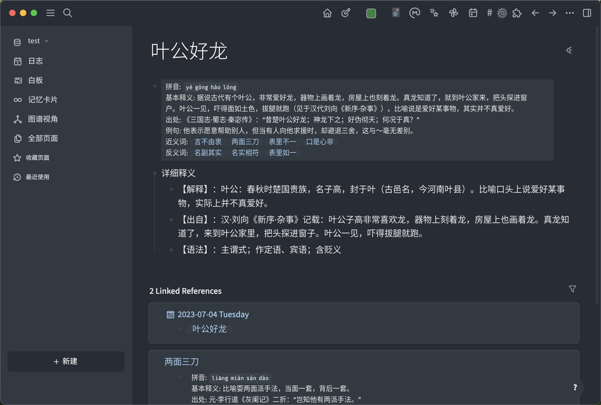

- # logseq-chinese-idiom-dictionary

  - 查询成语详细信息并插入页面的 Logseq 插件
	- 

- ## 功能
  - > 可插入以下信息
  - ### 拼音
  - ### 基本释义
  - ### 出处
  - ### 例句
  - ### 近义词
  - ### 反义词
  - ### 详细释义

- ## 演示
	- 
- ## 许可证
  - [MIT](https://choosealicense.com/licenses/mit/)
